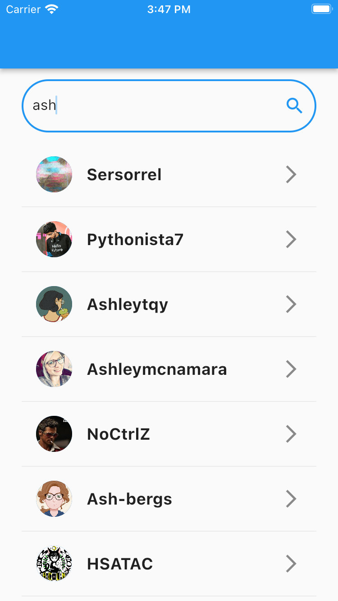
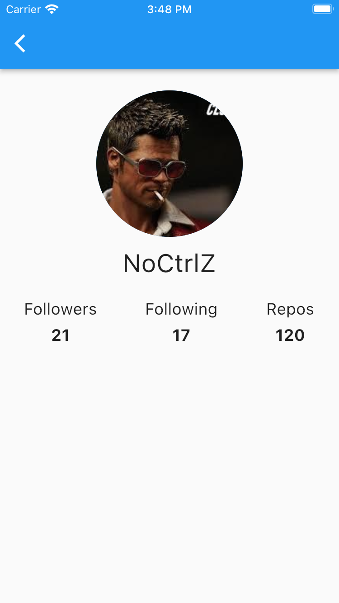

# Github demo

## Descrição
Esse app tem como principal objetivo exemplificar a integração com uma API external (API do GitHub). Foram usados o _dio_, para realizar as consultas via web, e o _get_it_, para fazer a injeção das dependências (repositories e controllers).

## Funcionalidades
- Pesquisar usuários pelo nome
- Ver detalhes de um usuário

## Screenshots

